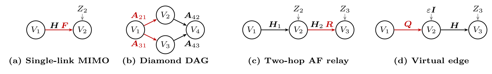
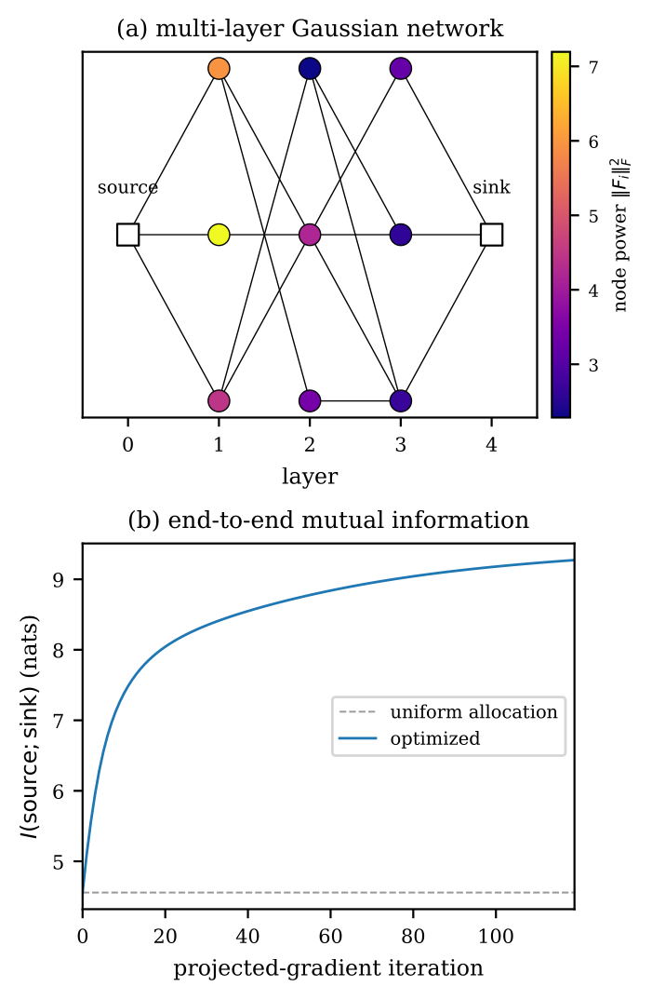

# gaussian-dag

[](LICENSE)
[](https://www.python.org/)

Mutual-information evaluation and gradient-based optimization for linear
Gaussian directed acyclic graphs (DAGs) via the *K-recursion*: a single
topology-agnostic forward pass that produces every cross- and auto-covariance
block needed by the log-det mutual information

```
I(X; Y) = log det Σ_Y − log det Σ_{Y|X}.
```

PyTorch's complex-autograd computes `∂I/∂Θ*` for every controllable edge
factor `Θ` in the DAG, and a simple projected-gradient-ascent (PGA) loop
drives the MI upward under Frobenius-ball or shared-budget constraints. No
per-topology gradient derivation is required.

This is the reference implementation accompanying the paper
*Mutual Information Optimization via K-Recursion and Automatic
Differentiation for Linear Gaussian Wireless Networks*
(Wadayama & Na, arXiv preprint, 2026 — citation block below).



*One library, four topologies. From left to right: (a) single-link MIMO
with controllable precoder `F`, (b) a diamond DAG with controllable
branch precoders `A_{2,1}` and `A_{3,1}` and fixed merging matrices
`A_{4,2}, A_{4,3}`, (c) a two-hop amplify-and-forward relay with
controllable relay gain `R`, and (d) input-covariance shaping via a
virtual edge with controllable input shaper `Q`. Controllable factors
and the edges that carry them are drawn in red; fixed channels in
black; dashed gray arrows are additive Gaussian noise injections. The same
`compute_k_blocks` + `pga_ascent` pipeline drives all four; runnable
scripts under `examples/` reproduce the corresponding MI trajectories
(see also Fig. 4 of the paper).*

> **Funding.** This work was supported by JST, CRONOS, Japan
> Grant Number **JPMJCS25N5**.

---

## Requirements

- Python ≥ 3.12
- PyTorch ≥ 2.12 (installed as a dependency)
- [`uv`](https://docs.astral.sh/uv/) for environment management (recommended)

## Installation

```bash
git clone https://github.com/wadayama/gaussian-dag.git
cd gaussian-dag
uv sync
```

This creates `.venv/` and installs all locked dependencies. Run any
subsequent command via `uv run python …` or `uv run pytest`.

Confirm the install:

```bash
uv run pytest
```

You should see all tests pass (a couple of GPU-only smoke tests are skipped
when no CUDA device is available — that is expected).

---

## Repository layout

```
gaussian-dag/
├── gaussian_dag/         core library (5 modules; see gaussian_dag/README.md)
├── tests/                pytest suite (27 tests; see tests/README.md)
├── examples/             5 runnable scripts reproducing Fig. 4 (a)-(d) and
│                         Fig. 5 of the paper (see examples/README.md)
├── docs/                 5-part Markdown tutorial walkthrough
│                         (see docs/README.md)
├── pyproject.toml        project metadata and dependencies (uv / pip)
├── LICENSE               MIT
└── README.md             this file
```

Each subdirectory has its own short `README.md` listing what is inside.
For library API and conventions, see `gaussian_dag/README.md`; for the
test inventory, `tests/README.md`; for example-by-example reproduction
recipes, `examples/README.md`; for the tutorial sequence, `docs/README.md`.

---

## Quick start

### Evaluate mutual information for a single-link MIMO channel

The model is `Y = H X + Z` with `X ~ CN(0, I_d)`, `Z ~ CN(0, σ² I_d)`. As a
DAG this is two nodes: `V_0 = X` (root) and `V_1 = Y`. Edge `0 → 1` carries
the channel matrix `H`; node 1 carries the receiver noise.

```python
import torch
from gaussian_dag import compute_k_blocks, mutual_information_from_k

torch.manual_seed(0)
d, sigma = 3, 0.5
H = torch.randn(d, d, dtype=torch.complex128)
Sigma_X = torch.eye(d, dtype=torch.complex128)
Sigma_Z = (sigma ** 2) * torch.eye(d, dtype=torch.complex128)

K = compute_k_blocks(
    num_nodes=2,
    parents={1: [0]},               # node 0 is the root
    edge_mats={(1, 0): H},          # A_{1,0} = H
    input_cov=Sigma_X,
    noise_covs={1: Sigma_Z},
)
mi = mutual_information_from_k(K, output_node=1, input_node=0)
print(f"I(X; Y) = {mi.item():.4f} nats")
```

### Optimize a precoder by projected gradient ascent

Replace the channel with `H @ F` for a learnable precoder `F` under the
Frobenius power budget `‖F‖_F² ≤ P`. Autograd flows through the K-recursion,
so PGA sees an exact analytic gradient.

```python
import torch
from gaussian_dag import (
    compute_k_blocks, mutual_information_from_k,
    pga_ascent, project_frobenius_ball,
)

torch.manual_seed(0)
d, sigma, P = 3, 0.5, 5.0
H = torch.randn(d, d, dtype=torch.complex128)
Sigma_X = torch.eye(d, dtype=torch.complex128)
Sigma_Z = (sigma ** 2) * torch.eye(d, dtype=torch.complex128)
F = (0.1 * torch.randn(d, d, dtype=torch.complex128)).requires_grad_(True)

def compute_mi():
    K = compute_k_blocks(
        num_nodes=2, parents={1: [0]},
        edge_mats={(1, 0): H @ F},
        input_cov=Sigma_X, noise_covs={1: Sigma_Z},
    )
    return mutual_information_from_k(K, output_node=1, input_node=0)

def projector(params):
    for p in params:
        p.copy_(project_frobenius_ball(p, P))

history = pga_ascent(
    compute_mi, [F], step_size=0.05, num_iters=200, projector=projector,
)
print(f"final MI = {history[-1]:.4f} nats")
```

For this 3×3 single-link channel, PGA converges to the classical
water-filling optimum (see `examples/single_link_mimo.py`).

---

## Public API

All symbols below are re-exported from the top-level package:

```python
from gaussian_dag import (
    compute_k_blocks, get_K, hermitianize,
    logdet_hpd, mutual_information_from_k,
    pga_ascent,
    project_frobenius_ball, project_total_power,
)
```

| Symbol | Module | Purpose |
| --- | --- | --- |
| `compute_k_blocks(num_nodes, parents, edge_mats, input_cov, noise_covs, *, symmetrize_self_blocks=True)` | `krecursion` | Forward pass of the K-recursion. Returns a dict of canonical blocks `K[(j,k)]` for `0 ≤ k ≤ j < num_nodes`. |
| `compute_effective_channel(num_nodes, parents, edge_mats, noise_covs, *, source_dim=None, symmetrize_self_blocks=True)` | `krecursion` | Collapse the DAG to an equivalent linear Gaussian channel `Y = G_M X + R_M`. Returns `(G, C)`: effective channel matrices `G[j]` (shape `d_j × d_X`, `G[0]=I`) and effective-noise covariance blocks `C[(j,k)]` (same canonical convention as `K`). Satisfies `K_{jk} = G_j Σ_X G_k^H + C_{jk}`; MI `= log det(G_M Σ_X G_M^H + C_MM) − log det C_MM`. Differentiable. |
| `get_K(K, a, b)` | `krecursion` | Read `K_{ab}` from the canonical dict, applying the Hermitian flip `K_{ab} = K_{ba}^H` when `a < b`. |
| `hermitianize(A)` | `krecursion` | Return `(A + A^H) / 2`. Used to enforce Hermitian structure against floating-point drift. |
| `mutual_information_from_k(K, output_node, input_node=0, *, jitter=0.0)` | `information` | Compute `I(X; Y) = log det Σ_Y − log det Σ_{Y\|X}` from K-blocks via Cholesky + Schur complement. Differentiable. |
| `logdet_hpd(A, jitter=0.0)` | `information` | Cholesky-based `log det A` for Hermitian positive-definite `A`. |
| `pga_ascent(compute_mi, params, *, step_size, num_iters, projector=None)` | `optimize` | Constant-step projected gradient *ascent* on a user-supplied MI closure. Returns a list of MI values (length `num_iters`). |
| `project_frobenius_ball(A, P)` | `projections` | Project `A` onto `{X : ‖X‖_F² ≤ P}` by uniform rescaling. |
| `project_total_power(params, P)` | `projections` | Project a list of matrices onto `{(A_m) : Σ_m ‖A_m‖_F² ≤ P}` (single shared scale factor). |

### Conventions

- **Indexing.** Node indices are 0-based; node 0 is the unique root. Edge
  keys are `(j, i)` for the edge `i → j` and must satisfy `i < j`
  (topological order). The accompanying paper uses 1-based indices; the
  structural content is identical.
- **Storage.** `compute_k_blocks` returns canonical lower-triangular blocks
  only (`j ≥ k`). Use `get_K` for symmetric access.
- **Edge factorization.** The paper factorises each edge matrix as
  `A_{j,i} = A_{j,i}^{(1)} A_{j,i}^{(2)} ⋯ A_{j,i}^{(K)}` and lets
  individual factors be controllable. The library has no built-in
  factor-product helper: edge factorization is handled by the
  user-supplied MI closure. Construct each `edge_mats[(j, i)]` from your
  fixed and trainable factors before calling `compute_k_blocks` (e.g.
  `H @ F` for a single-link precoder, or `H[(j, i)] @ F_i` to share the
  relay processing matrix `F_i` across every outgoing edge of relay `i`).
  PyTorch's autograd then handles the chain rule transparently. See
  `examples/multilayer_network.py` for a worked example of edge
  factorisation with parameter sharing.
- **Complex autograd.** PyTorch's `.grad` for a complex parameter `Θ` and a
  real scalar loss `I` equals `2 · ∂I/∂Θ*` (the Wirtinger gradient *without*
  the 1/2 factor; equivalently the real-Euclidean steepest-ascent direction
  on `Re Θ`, `Im Θ`). `pga_ascent` ascends in that direction directly; the
  factor of 2 is absorbed into the step size.
- **Units.** All MI values are in **nats** (natural logarithm).
- **Domain failures.** `mutual_information_from_k` (and the underlying
  `logdet_hpd`) require `Σ_Y` and `Σ_{Y|X}` to be strictly Hermitian
  positive-definite — the regularity assumption of the paper. The
  factorisation is performed via `torch.linalg.cholesky_ex`, so a domain
  violation surfaces as a clear `ValueError` (not an opaque autograd
  failure). If you hit it: (1) ensure that the terminal noise covariance
  `Σ_M` is strictly positive definite; (2) pass a small `jitter > 0` to
  absorb round-off near-singularity; or (3) inside a PGA loop, reduce the
  step size so that iterates remain in the open positive-definite cone.

---

## Examples and figure reproduction

Each script under `examples/` is self-contained and writes its results to
`examples/results/<name>.npz` and a figure to `examples/figures/<name>.pdf`.
The five scripts together reproduce Fig. 4 (a)-(d) and Fig. 5 of the paper.

### Run each example

| Command | Outputs | Expected final MI |
| --- | --- | --- |
| `uv run python examples/single_link_mimo.py` | `single_link_mimo.{npz,pdf}` | `8.4414 nats`, matches water-filling optimum (gap ≈ `5×10⁻⁴`) |
| `uv run python examples/diamond_dag.py` | `diamond_dag.{npz,pdf}` | `5.03 nats`, +2.27 over uniform branch-precoder baseline `2.76` |
| `uv run python examples/af_relay.py` | `af_relay.{npz,pdf}` | `7.20 nats`, +0.26 over uniform relay-gain baseline `6.94` |
| `uv run python examples/input_covariance.py` | `input_covariance.{npz,pdf}` | `8.4414 nats`, matches water-filling optimum (gap ≈ `5×10⁻⁴`) |
| `uv run python examples/multilayer_network.py` | `multilayer_network.{npz,pdf}` | `4.56 → 9.28 nats`, total power held at the budget `36.0` |

All numbers above are paper values reproduced exactly (to four decimal
places) on CPU with PyTorch 2.12 and IEEE double precision.

### What each example demonstrates

| Script | What it demonstrates |
| --- | --- |
| `single_link_mimo.py` (Fig. 4 (a)) | MIMO precoder optimization; PGA matches the classical water-filling optimum. |
| `diamond_dag.py` (Fig. 4 (b)) | Branch-precoder optimization on a 4-node diamond DAG; tracks the contribution of the parent cross-covariance to the merging-node block. |
| `af_relay.py` (Fig. 4 (c)) | 2-hop amplify-and-forward relay; the relay gain `R` is the controllable factor of the edge matrix `A_{2,1} = H_2 R`. |
| `input_covariance.py` (Fig. 4 (d)) | Input-covariance shaping via a *virtual edge* `X = Q X̃` with `X̃ ~ CN(0, I)`; recovers the water-filling optimum through a generic edge-matrix optimization. |
| `multilayer_network.py` (Fig. 5) | Multi-layer Gaussian network (11 nodes, 5 layers, 17 edges) with 9 broadcast relays optimized under a shared total-power budget. Reproduces Fig. 5 of the paper. |

### Multi-layer network: discovered non-uniform power allocation

<p align="center">
  
</p>

The same K-recursion + PGA pipeline that drove the four panels above
scales to an arbitrary multi-layer DAG. Above: a randomly generated
network of 11 nodes spanning 5 layers, with 9 relay nodes optimized
jointly under a *shared* total-power budget `P = 36`. Top panel:
relay nodes shaded by their optimized power `‖F_i*‖_F²`, revealing
the non-uniform allocation discovered by PGA. Bottom panel: end-to-end
mutual information rising from the uniform-allocation baseline of
`4.56 nats` to `9.28 nats` over `120` projected-gradient iterations.
No per-topology gradient was derived: one K-recursion forward pass
through the graph plus one reverse-mode AD sweep produces the Wirtinger
gradient at every relay simultaneously, and the shared-budget
projection distributes the power network-wide. See
`examples/multilayer_network.py`.

---

## Tutorials

A five-part walkthrough is available under `docs/`:

1. [Installation and your first MI evaluation](docs/tutorial-1-installation-and-first-mi.md)
2. [Building a DAG and reading K-blocks](docs/tutorial-2-building-a-dag.md)
3. [PGA optimization with constraints](docs/tutorial-3-pga-with-constraints.md)
4. [Parameter sharing (relay broadcast)](docs/tutorial-4-parameter-sharing.md)
5. [Reproducing Fig. 5 of the paper](docs/tutorial-5-reproducing-fig5.md)

---

## GPU support

The library is **device-agnostic**: every tensor it allocates inherits
`device` and `dtype` from its inputs, and no module hard-codes
`device="cpu"`. You can pass tensors on any device PyTorch supports and the
K-recursion + MI + PGA pipeline will follow.

Two CUDA smoke tests under `tests/test_gpu_smoke.py` exercise the forward
pass and a one-step PGA on the GPU when CUDA is available; they are
automatically skipped on CPU-only machines. The full pytest suite has been
verified to pass on an NVIDIA CUDA backend (`complex128`) without any
library-side changes.

What actually runs on each backend depends on PyTorch's support for the
underlying linear-algebra primitives (`torch.linalg.cholesky`,
`torch.linalg.solve`), *not* on this library. As of PyTorch 2.12:

| Backend | `complex128` | `complex64` | real (`float32`) |
| --- | --- | --- | --- |
| CPU | ✓ verified | ✓ | ✓ |
| CUDA (NVIDIA) | ✓ verified | ✓ (expected) | ✓ (expected) |
| MPS (Apple Silicon) | ✗ — MPS has no `float64` | ✗ — complex `linalg` not implemented for MPS | ✓ |

The standard workflow uses `complex128` on CPU or CUDA. On MPS you must
drop to a real-valued model (`float32`). If your problem genuinely requires
complex arithmetic, MPS is not currently a viable target — this is a
PyTorch backend limitation, not a property of this library.

The runnable scripts in `examples/` are device-agnostic: each declares
`DEVICE = torch.device("cuda" if torch.cuda.is_available() else "cpu")`
near the top, all tensor allocations pass `device=DEVICE`, and `.numpy()`
calls at the I/O boundary are written as `.cpu().numpy()`. The same
script therefore runs unchanged on CPU and on CUDA. To force CPU on a
CUDA machine, edit the single `DEVICE` line to `torch.device("cpu")`.

---

## Known limitations

- **Scope.** This library targets *linear Gaussian* DAGs only. Nonlinear
  elements (saturating amplifiers, quantisers, etc.) are not directly
  supported; Bussgang-style linearisations can be plugged in at the closure
  level, but the library has no built-in nonlinearity primitive.
- **Source structure.** The model assumes a single root node `V_0 = X`.
  Broadcast / multiple-access / interference channels are supported only
  in their reduced single-root form (stack roots / sinks if needed at the
  user level).
- **Edge factorisation.** The paper's `A_{j,i} = A_{j,i}^{(1)} ⋯ A_{j,i}^{(K)}`
  factorisation is handled by the user-supplied MI closure; the library
  exposes only the already-composed `edge_mats[(j, i)] = A_{j,i}`. This
  keeps the core minimal but means users compose factors themselves
  (typical pattern: `H @ F` for a precoder, `H[(j, i)] @ F_i` for a relay).
- **Optimization.** `pga_ascent` is intentionally minimal: constant
  step size, no momentum, no line search, no early stopping. Non-convex
  objectives are reached only to stationary points; multi-start is
  recommended for production use.
- **Positive-definiteness.** `mutual_information_from_k` requires `Σ_Y`
  and `Σ_{Y|X}` strictly positive-definite (Cholesky path). Inputs that
  drift out of the PD cone surface as a diagnostic `ValueError`; mitigate
  with `jitter > 0` or by tightening the regularity assumptions of the
  problem (see *Conventions → Domain failures*).
- **GPU.** Forward and backward passes are device-agnostic, and the full
  pytest suite has been verified to pass on an NVIDIA CUDA backend with
  `complex128`. As of PyTorch 2.12, MPS does not implement complex
  `cholesky` / `solve` and is therefore unusable for the complex pipeline
  (see *GPU support*).
- **Numerical reproducibility.** Single-run numbers depend on the PyTorch
  / NumPy versions and the random-number generation paths therein. The
  paper figures were generated with PyTorch 2.12 on CPU; minor last-digit
  drift on other versions is expected and is not a regression.

---

## Citation

If you use this library in academic work, please cite the accompanying paper:

```bibtex
@article{wadayama2026gaussiandag,
  title  = {Mutual Information Optimization via K-Recursion and
            Automatic Differentiation for Linear Gaussian Wireless Networks},
  author = {Wadayama, Tadashi and Na, Siqi},
  year   = {2026},
  eprint = {TBD},
  archivePrefix = {arXiv},
  primaryClass  = {cs.IT},
}
```

(The arXiv identifier will be filled in once the preprint is posted.)

### Acknowledgement

This work was supported by JST, CRONOS, Japan Grant Number JPMJCS25N5.

---

## License

`gaussian-dag` is released under the [MIT License](LICENSE).
